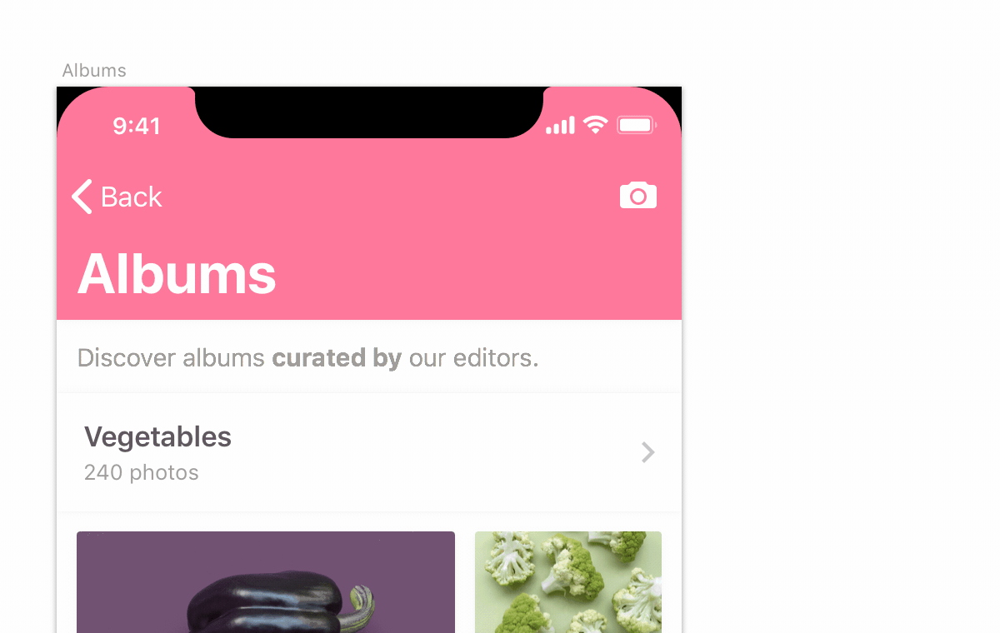

# Emoji Autocomplete Sketch Plugin
While editing Sketch text layers, type `:` followed by the first few letters to autocomplete emojis. 🍒

## Installation
- [Download](https://github.com/zeplin/emoji-autocomplete-sketch-plugin/releases/download/v0.1/Emoji.Autocomplete.sketchplugin.zip) latest release, 0.1.
- Double click downloaded file `Emoji Autocomplete.sketchplugin`.

## Usage
While editing text layers, type `:` followed by a few letters to display a list of emojis to autocomplete from. Use the arrow keys or your mouse to select one.

